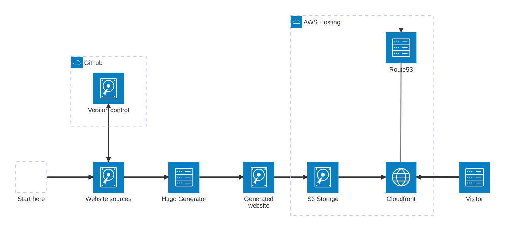

# Stroud Masters Website

## Background
Broadly speaking there are three common ways of hosting small websites

- Website platforms (e.g. Squarespace, Wix)
  - Easy to use
  - Low maintenance
  - Starts from ~£12 a month
- Content Management Systems (e.g. Wordpress)
  - Fairly easy to use
  - Often requires additional maintenance (backups, updates...)
  - Security can be a concern
  - Starts from ~£6 a month
- Statically generated sites
  - The website is simply a bunch of files
  - Not quite as user friendly to update... but a lot fewer moving parts
  - Starts from ~£0.50 a month

We originally used a CMS (Wordpress) but the ongoing maintenance was a bit of a pain, and keeping costs low usually involved changing hosting providers every year.

Experimenting with a statically generated site was pretty encouraging- there was a  a reasonable workflow for making updates, maintenance tasks were low and the pricing was very competitive.

However this is coming from someone who does computer programming for a living. Other factors may be important for future maintainers of the site.

## Overview

Here is the rough architecture of the current site



Moving from the start point on the far left

- Website sources

  These are the sources used to generate the website. They are composed of Markdown (.md) files and other associated media that get processed by a program called [Hugo](https://gohugo.io) to generate the HTML required for the website.

  The nice thing about Markdown is that it's a very lightweight language and so allows you to focus on the content rather than it's presentation. Hugo takes the Markdown and does all the time consuming an annoying stuff for you, for example

  - Creating html that works correctly on mobile and desktop
  - Applying themes to make content look nice
  - Automatically organising content by date
  - Creating sitemaps and other structures required by search engines

- Version control (optional)

  The general concensus in computer science is that text based sources are best managed through version control systems.

  Version control systems allow you to register files and formally record how things change over time. Most importantly they are an excellent way of performing backups- if I were to accidentally delete a page then I can easily restore it from the Version control system.

  There are variety of Version control systems out there but the trend has generally been towards `git`. Microsoft provides a free git hosting service called [github](https://github.com) which is what we currently use.

  If my laptop were to break then all the website sources are safely backed up on the [github repository](https://github.com/freewill7/stroudmasters).

- Hugo Generator

  As mentioned this is a program that changes the website sources into html. More on this program later.

- Generated website

  We now have a generated website but this needs to publicly available in order for people to see it (i.e. "hosted). This is where we use Amazon Web Services (AWS).

  There are lots of providers that can be used for hosting websites (Microsoft Azure, Google Cloud...) but I went for AWS as it's well established and reasonably priced.

- S3 Storage

  This is a file storage service provided my Amazon. It can be configured in lots of different ways... but we keep things simple and have everything read-only (so only we can modify things).
  
  The `Generated website` is uploaded to S3.

- Cloudfront

  This is a caching service provided by Amazon. Traditionally this is used to improve website performance, however in our case it's also a cost saving feature.

  Fetching an individual object directly from S3 means Amazon has to fully retrieve the object (in case it's been modified since the last time it was read). And this is reflected in the cost ($0.0004	per 1000 requests).

  However by using a cache, and alerting Amazon when an object has changed, this allows them to better optimise their computer resources. And in exchange we receive 10,000,000 free requests every month before prices return to normal S3 pricing.
  
  In practice this probably a negligible saving for us but does protect us if we somehow go viral (or are the target of a DDOS attack).

- Route 53

  This is the service used for domain name registration.

  We pay them a fixed amount of every year so that requests to stroudmasters.org go to the appropriate place.

- Visitor

  And finally we have a website visitor.

  When they click a link or type stroudmasters.org into their browser then the Route53 service is used to tell the browser where to go.

  The browser is directed to our Cloudfront service and downloads a cache of our Generated website and happily browses away.

## Generating the website 

### Setting up hugo
The only true requirement for building the website is `hugo` which has install instructions on their website [https://gohugo.io](https://gohugo.io). Ideally you should be able to install it through a package manager, worst case you can use a pre-built version (e.g. at [https://github.com/gohugoio/hugo/releases/tag/v0.138.0](https://github.com/gohugoio/hugo/releases/tag/v0.138.0) ).

With hugo installed, I can open the command line on my Mac and run

```sh
hugo version
```

And have the following output 

```
hugo v0.123.8-5fed9c591b694f314e5939548e11cc3dcb79a79c+extended darwin/arm64 BuildDate=2024-03-07T13:14:42Z VendorInfo=brew
```

### Getting the website sources

The website sources can be found at [https://github.com/freewill7/stroudmasters](https://github.com/freewill7/stroudmasters).

Clicking on the `<> Code` button should present options to download the sources.

If you want to continue using git to manage changes then you'll want to select one of the `Clone` options or the `Open with GitHub Desktop`.

If you just want to download the sources to see what's currently being used, then `Download ZIP` is an easy option with minimal dependencies.

After you've downloaded the sources go to the `stroudmasters` folder on your computer (this may require unzipping the downloaded file.)

```sh
cd stroudmasters
ls -1 # or DIR on windows
```

This results in output such as the following

```
README.md
config.toml
content
layouts
public
static
sync.sh
themes
```

### Testing the sources

With everything set up you should be able to run

```
hugo serve
```

This will compile the sources and set-up a local webserver to test the generated content. On my laptop the command returns

```
...
Web Server is available at http://localhost:1313/ (bind address 127.0.0.1) 
```

Visting this address in a browser will give you a preview of the site.

### Guide to the sources

* config.toml 

  These are the main settings for hugo, things like
  - Theme
  - Menu entries
  
  I rarely have to change these

* content

  This is where the textual content for the site lives. Each directory maps will map onto a URL with the accompanying `_index.md` being the content.
  
  For example, the home page is `content/_index.md` (equivalent to https://stroudmasters.org). And the calendar lives at `content/calendar/_index.md` (equivalent to https://stroudmasters.org/calendar).

  The `posts` directory is a bit more fancy. hugo will automatically order entries based upon their date (this is how we implement https://stroudmasters.org/news ). 

  For example, the `content/posts/2024/11/tuesday_12_session.md` has **date** and **title** metadata used for creating lists.

* layouts

  A directory used by hugo- rarely/never has to be touched.

* static
  
  This is where static, binary resources such as images and documents are stored. These are organised into date based directories to help keep things manageable.

  For example the new membership form might live in `images/2024/11/Membership_Form_2025.pdf`.

* themes

  This is where hugo retrieves it's theming info from. Rarely needs to be touched.

* public

  This is where hugo stores the generated website. This should never be modified directly.

### Common tasks

Here is my workflow for a number of common update tasks

#### Updating the membership form

1. Rename the form so it doesn't contain spaces

```sh
mv Membership\ Form\ 2025.pdf Membership_Form_2025.pdf
```

2. Copy the membership form into the static resources directory and register into the version management system 

```sh
cp ~/Downloads/Membership_Form_2025.pdf static/images/2024/11/
git add static/images/2024/11/Membership_Form_2025.pdf
```

3. Update the `about` section 

```sh
open content/about/_index.md
```

```md
- [Membership Form 2024](/images/2024/11/Membership_Form_2025.pdf)
```

4. Test the changes

```sh
hugo serve
```

5. Add the about change to version control

```sh
git add content/about/_index.md
```

5. Commit the changes to version control

```
git commit
```

6. (Optionally) back up version control changes remotely

```
git push
```

#### Adding a news post

1. Create a directory for the current month

```sh
mkdir content/posts/2024/11
```

2. Copy a previous entry or fill in a template

```sh
vim content/posts/2024/11/exciting_news.md
```

Example:

```md
---
title: "TODO TITLE"
date: 2024-11-06T17:44:00+0000
draft: false
---
TODO CONTENT
<!--more-->
```

Note:
- date is in GMT which might trip you up in the summer
- the `<!--more>` tag prevents content from being clipped on the news page

3. Test the changes

```
hugo serve
```

4. Add the new entry to version control

```sh
git add content/posts/2024/11/exciting_news.md
```

5. Commit the change to version control

```sh
git commit
```

6. (Optionally) back up version control changes remotely

```
git push
```


### Updating AWS copy of generated website

To perform the synchronisation with AWS you'll need the [awscli](https://aws.amazon.com/cli/) utility along with ssh keys.

- Generate website

  This is different to the `hugo serve` command that we use to test changes

  ```sh
  hugo
  ```

- Synchronise with s3

  ```
  python3 -m awscli s3 sync --exclude "*.DS_Store*" ./public s3://stroudmasters.org
  ```

- Refresh cloudfront cache

  ```
  aws cloudfront create-invalidation --distribution-id [SECRET] --paths '/*'
  ```

